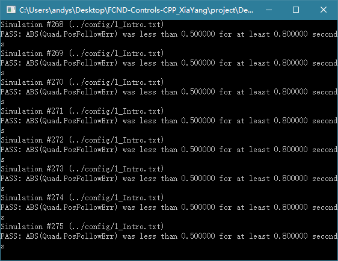
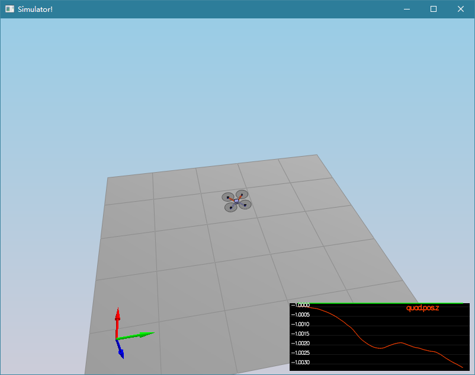
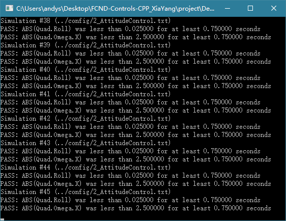
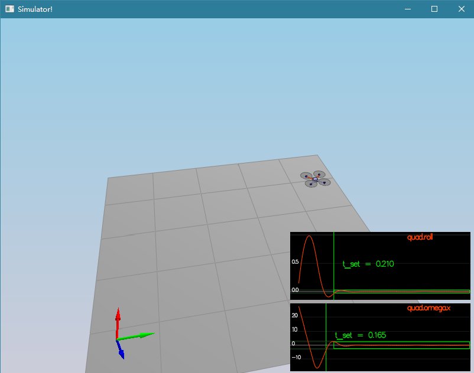
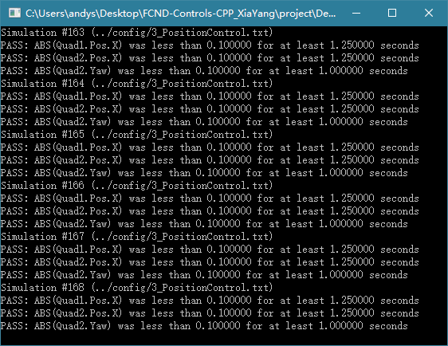
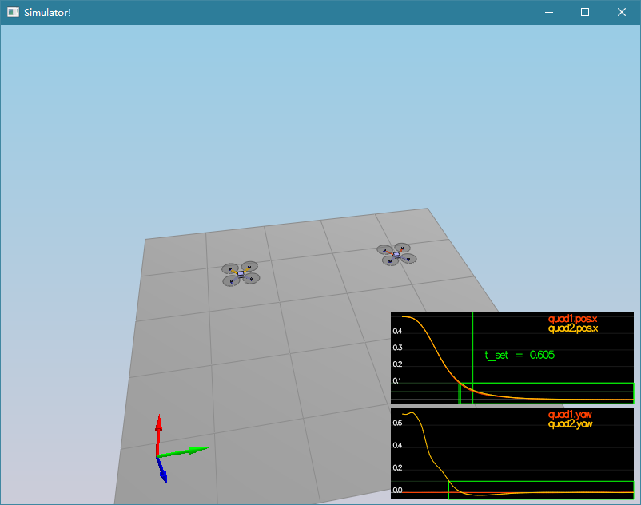
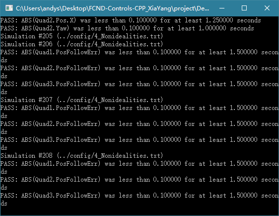
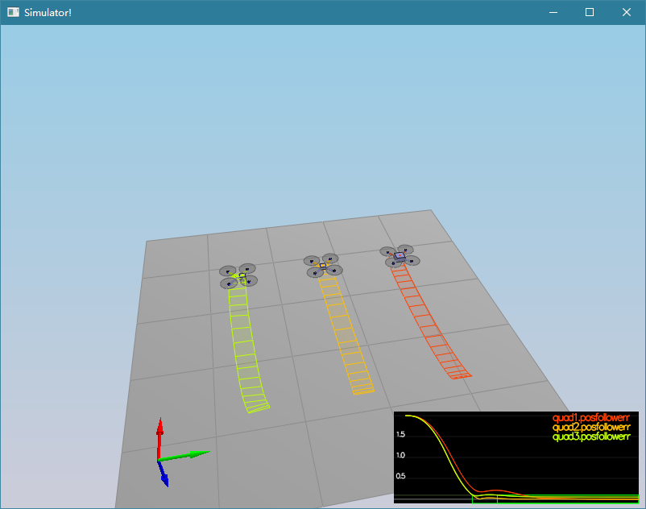
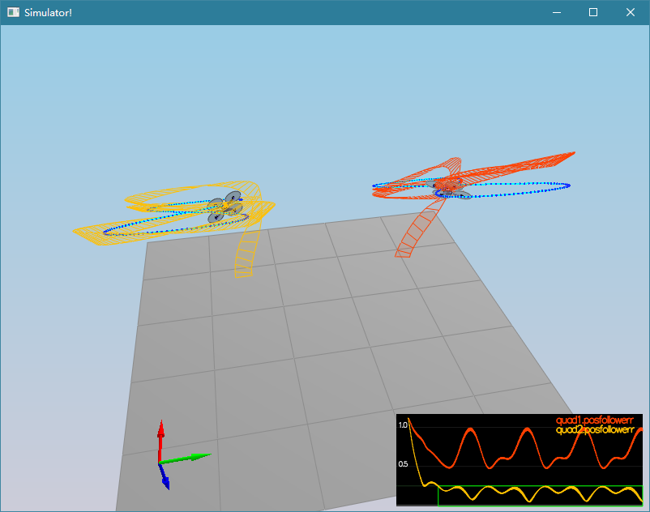

# FCND-Controls-CPP Project
## Control Inputs
F1 : front left thrust
F2 : front right thrust
F3 : rear left thrust
F4 : rear right thrust

## Controllers
### Generate Motor Commands
Convert a desired 3-axis moment and collective thrust command to individual motor thrust commands
#### Specifications
- The thrust and moments should be converted to the appropriate 4 different desired thrust forces for the moments
- Ensure that the dimensions of the drone are properly accounted for when calculating thrust from moments.
#### Details
- Get a distance between x-axis and propeller location. It is equal to half of the distance between neighboring propellers at 45° relative to each axis.
- Calculate Ft, Fp, Fq, Fr.
- From the equations:
```
  F1 + F2 + F3 + F4 = Ft
  F1 - F2 + F3 - F4 = Fp
  F1 + F2 - F3 - F4 = Fq
- F1 + F2 + F3 - F4 = Fr
```
calculate F1, F2, F3, and F4:
```
F1 = (Ft + Fp + Fq - Fr) / 4
F2 = F1 - (Fp - Fr) / 2
F4 = (Ft - Fp) / 2 - F2
F3 = Ft - F1 - F2 - F4
```
- Clip the thrusts to min and max values,  and then pass these clipped values to the motors.
#### Code
```
VehicleCommand QuadControl::GenerateMotorCommands(float collThrustCmd, V3F momentCmd)
{
  // Convert a desired 3-axis moment and collective thrust command to
  //   individual motor thrust commands
  // INPUTS:
  //   desCollectiveThrust: desired collective thrust [N]
  //   desMoment: desired rotation moment about each axis [N m]
  // OUTPUT:
  //   set class member variable cmd (class variable for graphing) where
  //   cmd.desiredThrustsN[0..3]: motor commands, in [N]

  // HINTS:
  // - you can access parts of desMoment via e.g. desMoment.x
  // You'll need the arm length parameter L, and the drag/thrust ratio kappa

  ////////////////////////////// BEGIN STUDENT CODE ///////////////////////////

  //cmd.desiredThrustsN[0] = mass * 9.81f / 4.f; // front left
  //cmd.desiredThrustsN[1] = mass * 9.81f / 4.f; // front right
  //cmd.desiredThrustsN[2] = mass * 9.81f / 4.f; // rear left
  //cmd.desiredThrustsN[3] = mass * 9.81f / 4.f; // rear right

	float l = L / sqrt(2.F);

    float Ft = collThrustCmd;
    float Fp = momentCmd.x / l;
    float Fq = momentCmd.y / l;
    float Fr = momentCmd.z / kappa;

    float F1 = (Ft + Fp + Fq - Fr) / 4;
    float F2 = F1 - (Fp - Fr) / 2;
    float F4 = (Ft - Fp) / 2 - F2;
    float F3 = Ft - F1 - F2 - F4;

    cmd.desiredThrustsN[0] = CONSTRAIN(F1, minMotorThrust, maxMotorThrust); // front left
    cmd.desiredThrustsN[1] = CONSTRAIN(F2, minMotorThrust, maxMotorThrust); // front right
    cmd.desiredThrustsN[2] = CONSTRAIN(F3, minMotorThrust, maxMotorThrust); // rear left
    cmd.desiredThrustsN[3] = CONSTRAIN(F4, minMotorThrust, maxMotorThrust); // rear right

  /////////////////////////////// END STUDENT CODE ////////////////////////////

  return cmd;
}
```

### BodyRate Controller
Calculate a desired 3-axis moment given a desired and current body rate
#### Specifications
- The controller should be a proportional controller on body rates to commanded moments
- The controller should take into account the moments of inertia of the drone when calculating the commanded moments
#### Details
- V3F structure used to store moments of inertia in every axis
- kpPQR is a V3F used to store proportional gains on angular velocity on all axes
- Moment = (Moment of Inertia) x (Angular Acceleration)
- (Angular Acceleration) = kpPQR x (body rate desired - observed)
#### Code
```
V3F QuadControl::BodyRateControl(V3F pqrCmd, V3F pqr)
{
  // Calculate a desired 3-axis moment given a desired and current body rate
  // INPUTS:
  //   pqrCmd: desired body rates [rad/s]
  //   pqr: current or estimated body rates [rad/s]
  // OUTPUT:
  //   return a V3F containing the desired moments for each of the 3 axes

  // HINTS:
  //  - you can use V3Fs just like scalars: V3F a(1,1,1), b(2,3,4), c; c=a-b;
  //  - you'll need parameters for moments of inertia Ixx, Iyy, Izz
  //  - you'll also need the gain parameter kpPQR (it's a V3F)

  V3F momentCmd;

  ////////////////////////////// BEGIN STUDENT CODE ///////////////////////////

  momentCmd = V3F(Ixx, Iyy, Izz) * kpPQR * (pqrCmd - pqr);

  /////////////////////////////// END STUDENT CODE ////////////////////////////

  return momentCmd;
}
```

### RollPitch Controller
Calculate a desired pitch and roll angle rates based on a desired global lateral acceleration, the current attitude of the quad, and desired collective thrust command.
#### Specifications
- The controller should use the acceleration and thrust commands, in addition to the vehicle attitude to output a body rate command.
- The controller should account for the non-linear transformation from local accelerations to body rates.
- Note that the drone's mass should be accounted for when calculating the target angles.
#### Details
- Obtain current tilt from the rotation matrix R.
- Compute the desired tilt by normalizing the desired acceleration by the thrust.
- Prevent drone flipping using max-min constrain.
- Determine the desired roll and pitch rate in the world frame.
- Tune kpBank and kpPQR.
#### Code
```
V3F QuadControl::RollPitchControl(V3F accelCmd, Quaternion<float> attitude, float collThrustCmd)
{
  // Calculate a desired pitch and roll angle rates based on a desired global
  //   lateral acceleration, the current attitude of the quad, and desired
  //   collective thrust command
  // INPUTS:
  //   accelCmd: desired acceleration in global XY coordinates [m/s2]
  //   attitude: current or estimated attitude of the vehicle
  //   collThrustCmd: desired collective thrust of the quad [N]
  // OUTPUT:
  //   return a V3F containing the desired pitch and roll rates. The Z
  //     element of the V3F should be left at its default value (0)

  // HINTS:
  //  - we already provide rotation matrix R: to get element R[1,2] (python) use R(1,2) (C++)
  //  - you'll need the roll/pitch gain kpBank
  //  - collThrustCmd is a force in Newtons! You'll likely want to convert it to acceleration first

  V3F pqrCmd;
  Mat3x3F R = attitude.RotationMatrix_IwrtB();

  ////////////////////////////// BEGIN STUDENT CODE ///////////////////////////

  float c = collThrustCmd / mass;
  V3F b = V3F(R(0, 2), R(1, 2), 0.f);
  V3F b_c = V3F(-accelCmd.x / c, -accelCmd.y / c, 0.f);
  b_c.constrain(-maxTiltAngle, maxTiltAngle);

  V3F b_error = b_c - b;
  V3F b_c_dot = kpBank * b_error;

  pqrCmd.x = (R(1, 0) * b_c_dot.x - R(0, 0) * b_c_dot.y) / R(2, 2);
  pqrCmd.y = (R(1, 1) * b_c_dot.x - R(0, 1) * b_c_dot.y) / R(2, 2);
  pqrCmd.z = 0.f;

  /////////////////////////////// END STUDENT CODE ////////////////////////////

  return pqrCmd;
}
```

### Altitude Controller
Calculate desired quad thrust based on altitude setpoint, actual altitude,  vertical velocity setpoint, actual vertical velocity, and a vertical  acceleration feed-forward command.
#### Specifications
- The controller should use both the down position and the down velocity to command thrust
- Ensure that the output value is indeed thrust (the drone's mass needs to be accounted for)
- Ensure that the thrust includes the non-linear effects from non-zero roll/pitch angles
#### Details
- Ensure z velocity command is within limits.
- Compute Error integration part of the PID.
- Determine desired acceleration, vertical acceleration in body frame.
- Compute trust.
#### Code
```
float QuadControl::AltitudeControl(float posZCmd, float velZCmd, float posZ, float velZ, Quaternion<float> attitude, float accelZCmd, float dt)
{
  // Calculate desired quad thrust based on altitude setpoint, actual altitude,
  //   vertical velocity setpoint, actual vertical velocity, and a vertical
  //   acceleration feed-forward command
  // INPUTS:
  //   posZCmd, velZCmd: desired vertical position and velocity in NED [m]
  //   posZ, velZ: current vertical position and velocity in NED [m]
  //   accelZCmd: feed-forward vertical acceleration in NED [m/s2]
  //   dt: the time step of the measurements [seconds]
  // OUTPUT:
  //   return a collective thrust command in [N]

  // HINTS:
  //  - we already provide rotation matrix R: to get element R[1,2] (python) use R(1,2) (C++)
  //  - you'll need the gain parameters kpPosZ and kpVelZ
  //  - maxAscentRate and maxDescentRate are maximum vertical speeds. Note they're both >=0!
  //  - make sure to return a force, not an acceleration
  //  - remember that for an upright quad in NED, thrust should be HIGHER if the desired Z acceleration is LOWER

  Mat3x3F R = attitude.RotationMatrix_IwrtB();
  float thrust = 0;

  ////////////////////////////// BEGIN STUDENT CODE ///////////////////////////

  float z_err = posZCmd - posZ;
  velZCmd += kpPosZ * z_err;
  velZCmd = CONSTRAIN(velZCmd, - maxAscentRate, maxDescentRate);

  integratedAltitudeError += z_err * dt;
  float z_err_dot = velZCmd - velZ;
  accelZCmd += KiPosZ * integratedAltitudeError + kpVelZ * z_err_dot;

  float b_z = R(2, 2);
  thrust = mass * ((float)CONST_GRAVITY - accelZCmd) / b_z;

  /////////////////////////////// END STUDENT CODE ////////////////////////////

  return thrust;
}
```

### LateralPosition Controller
Calculate the desired acceleration in the global frame based on desired lateral position/velocity/acceleration and current pose.
#### Specifications
- The controller should use the local NE position and velocity to generate a commanded local acceleration
#### Details
- Contrain desired velocity.
- Determine PD controller + feedforward.
- Constrain desired acceleration.
#### Code
```
V3F QuadControl::LateralPositionControl(V3F posCmd, V3F velCmd, V3F pos, V3F vel, V3F accelCmdFF)
{
  // Calculate a desired horizontal acceleration based on
  //  desired lateral position/velocity/acceleration and current pose
  // INPUTS:
  //   posCmd: desired position, in NED [m]
  //   velCmd: desired velocity, in NED [m/s]
  //   pos: current position, NED [m]
  //   vel: current velocity, NED [m/s]
  //   accelCmdFF: feed-forward acceleration, NED [m/s2]
  // OUTPUT:
  //   return a V3F with desired horizontal accelerations.
  //     the Z component should be 0
  // HINTS:
  //  - use the gain parameters kpPosXY and kpVelXY
  //  - make sure you limit the maximum horizontal velocity and acceleration
  //    to maxSpeedXY and maxAccelXY

  // make sure we don't have any incoming z-component
  accelCmdFF.z = 0;
  velCmd.z = 0;
  posCmd.z = pos.z;

  // we initialize the returned desired acceleration to the feed-forward value.
  // Make sure to _add_, not simply replace, the result of your controller
  // to this variable
  V3F accelCmd = accelCmdFF;

  ////////////////////////////// BEGIN STUDENT CODE ///////////////////////////

  V3F error = posCmd - pos;
  velCmd += kpPosXY * error;

  velCmd.x = CONSTRAIN(velCmd.x, - maxSpeedXY, maxSpeedXY);
  velCmd.y = CONSTRAIN(velCmd.y, - maxSpeedXY, maxSpeedXY);

  V3F error_dot = velCmd - vel;
  accelCmd += kpVelXY * error_dot;

  accelCmd.x = CONSTRAIN(accelCmd.x, - maxAccelXY, maxAccelXY);
  accelCmd.y = CONSTRAIN(accelCmd.y, - maxAccelXY, maxAccelXY);
  accelCmd.z = 0.F;

  /////////////////////////////// END STUDENT CODE ////////////////////////////

  return accelCmd;
}
```

### Yaw Controller
Calculate the desired yaw rate from the commanded yaw and the yaw parameters.
#### Specifications
- The controller can be a linear/proportional heading controller to yaw rate commands (non-linear transformation not required)
#### Details
- Compute yaw delta between commanded and observed yaw values.
- Ensure you always travel the smallest angle from observed yaw to commanded yaw.
- Normalize the error using fmodf to account for angle wrap.
- Compute yaw rate with the proportional yaw constant.

#### Code
```
float QuadControl::YawControl(float yawCmd, float yaw)
{
  // Calculate a desired yaw rate to control yaw to yawCmd
  // INPUTS:
  //   yawCmd: commanded yaw [rad]
  //   yaw: current yaw [rad]
  // OUTPUT:
  //   return a desired yaw rate [rad/s]
  // HINTS:
  //  - use fmodf(foo,b) to unwrap a radian angle measure float foo to range [0,b].
  //  - use the yaw control gain parameter kpYaw

  float yawRateCmd=0;
  ////////////////////////////// BEGIN STUDENT CODE ///////////////////////////

  float error = yawCmd - yaw;
  error = fmodf(error, 2 * F_PI);
  yawRateCmd = kpYaw * error;

  /////////////////////////////// END STUDENT CODE ////////////////////////////

  return yawRateCmd;

}
```

## Flight Evaluation
Ensure that in each scenario the drone looks stable and performs the required task. Specifically check that the student's controller is able to handle the non-linearities of scenario 4 (all three drones in the scenario should be able to perform the required task with the same control gains used).
### Scenario 1_Intro


### Scenario 2_AttitudeControl


### Scenario 3_PositionControl


### Scenario 4_NonIdealities


### Scenario 5_TrajectoryFollow

